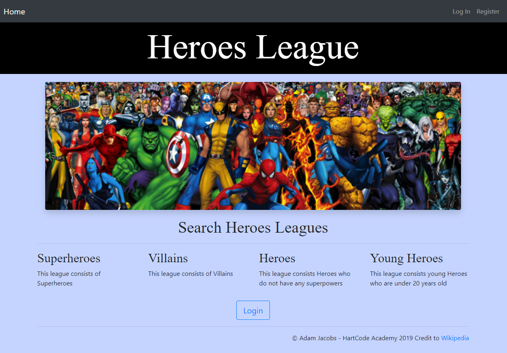

# MEAN_Final_Project Repository for the Capstone Project - Heroes League!



## Site Author
* **Adam Jacobs** - HartCode Academy 2019

## Purpose and goals of this site
- To display the leagues, teams, and members for heros and villians.
- To register, edit, and delete site users. 
- To view hero teams and members.

## Audience
- Prospective and current team managers.
- Prospective and current heroes and villians.  
- Prospective and current users to the site.

### Actions for my site?
- To view the hero and villian leagues, teams, and members.
- To sign up users for the site.
- To edit user's information.
- To be able to unregister users and delete their account.

## Site Pages:
- Home Page
- Login Page
- Register Page
- Edit User Profile Page
- Teams Page (Landing Page)
- Admin Page (For an Admin.  Details non-admin users)

## Server for Capstone - Node/Express/PostgreSQL/Sequelize

### Data Rendered:

- Users Data from ProsgreSQL file users
http://localhost:3000/users

- Leagues Data from JSON file leagues
http://localhost:3000/leagues

- Teams Data from JSON file teams
http://localhost:3000/teams

### Technologies
- HTML5/CSS3/Bootstrap4
- Node.js
- ProgreSQL

### PostgreSQL

Note: This will use [PostgreSQL](https://www.postgresql.org/) in place of [MongoDB](https://www.mongodb.com/) for our Database. 

## Server start
+ run ```npm start``` to start the server
+ to run in development mode, to use the debugger, run ```npm run dev``` to start the server

```
$ cd server
$ npm run dev 
```

## PostgreSQL Setup
+ Create PostgreSQL DB User as defined above
+ Create a DB named demo in PostgreSQL using [pgAdmin4](http://127.0.0.1:54388/browser/)
+ Execute the following to build and populate the DB with test data
```
$ cd db
$ node migrate
$ node seed
```

## Client start

```
$ cd client
$ ng serve
...
webpack: Compiled successfully.
```
- To view the home page in the browser, you would go to:
http://localhost:4200/